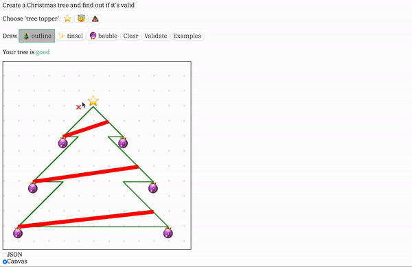

# Policing Christmas Trees

Safe, organised fun is the best kind of fun - _especially_ when Christmas
trees are involved.

This project was prepared as a demo of [OPA](https://www.openpolicyagent.org)
for the 2019 _Christmas_ Show & Tell of the
[London Computation Club](https://london.computation.club).

While this is a really silly idea for a project; I found it helpful to apply a
work tool in a completely different (& fictional) domain.

## Dependencies

You need to have Docker and Docker Compose to run the demo.

## Demo

```shell
docker-compose build
docker-compose up
```

Then you can browse to [localhost:8082](http://localhost:8082).

## Demo Recording


